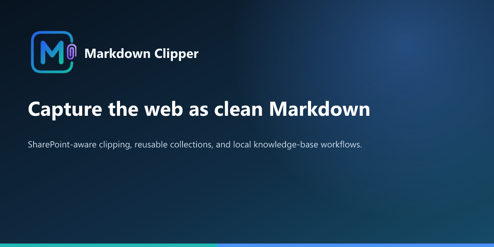

# Markdown Clipper

A Chrome extension that turns web pages into clean Markdown — with first-class support for
SharePoint. Copy, download, save into a local knowledge vault, or export whole sites while
preserving their structure.

> **Release candidate:** 1.1.0 on `feature/clipper-expansion`. The source passes 360 automated
> tests, lint, and release validation. Complete the
> [browser verification checklist](docs/browser-verification-checklist.md) before publishing.
> See [CHANGELOG.md](CHANGELOG.md) for the full release history.

## What it does

- **Capture the active page as Markdown** — copy to clipboard, download a `.md` file, or open
  the Markdown in a new tab.
- **Know what is already clipped** — a compact header indicator shows whether the current URL
  was saved before and whether its normalized visible Markdown appears current or changed.
- **SharePoint-aware** — scrolls to trigger lazy-loaded sections and uses a scored content-root
  finder to skip chrome/navigation and keep the real page content. Full-action loading runs only
  when needed, so opening the preview does not visibly scroll the page.
- **Saved collections** — save SharePoint, Confluence, general websites, or custom URL lists;
  refresh inventories to detect changes without duplicates; and export one inventory or all
  collection metadata as CSV.
- **Local Collections Library** — choose one local root and sync each saved collection into its
  own type/name folder as normal Markdown files with `index.md`, `collection.json`, and a
  non-destructive sync report suitable for LLMs, desktop search, backup, or sharing. Incremental
  sync skips unchanged files, multi-host lists stay grouped by host, and a root catalog links all
  synced collections.
- **Works on any page** — general webpages use Mozilla Readability article extraction, with a
  full-page fallback. A capture **mode** setting (auto / sharepoint / article / full) lets you
  override.
- **Front matter & templating** — emit YAML front matter (or a plain list, or nothing), or
  define your own note + filename templates with `{{variable|filter}}` substitution
  (`{{title}}`, `{{author}}`, `{{date}}`, `{{meta:…}}`, `{{schema:…}}`, `{{selector:…}}`),
  inspired by the Obsidian Web Clipper.
- **Export a collection** — import URLs from TXT, CSV, or XLSX; discover them from a sitemap,
  `llms.txt`, saved collection, or same-site crawl; then export a structure-preserving ZIP and/or
  aggregate Markdown file. Host access is requested per-site, only when you start.
- **Flexible surfaces** — use the toolbar popup, Chrome side panel, or a draggable/resizable
  in-page panel; selection clipping is also available from the context menu.
- **Knowledge vault workflow** — save clips to a chosen local folder, maintain a wiki-style
  index, apply deterministic tag rules, and generate prompts from the local clip log.
- **Site-aware capture** — adapters for SharePoint and Confluence plus cleaner X/Twitter post,
  quote, article-preview, and author-thread capture.
- **Local and private** — all conversion happens in your browser. No backend, no analytics, no
  remote code. See [PRIVACY.md](PRIVACY.md).

## Install locally (unpacked)

1. `npm install` (first time only — pulls dev tooling and vendored libraries).
2. `npm run vendor` (first time only — writes the bundled libraries into
   `extension/src/vendor/`).
3. Open `chrome://extensions`, enable **Developer mode**, choose **Load unpacked**, and select
   the **`extension/`** folder (not the repo root).

## Develop

| Command | What it does |
| --- | --- |
| `npm test` | Run the `node --test` suite. |
| `npm run lint` | Lint `extension/src` with ESLint. |
| `npm run release:check` | Run tests, lint, and manifest/release validation. |
| `npm run store:prepare` | Capture, label, generate, and validate the Chrome Web Store artwork. |
| `npm run store:promos` | Regenerate promo tiles and the GitHub social image only. |
| `npm run store:check` | Validate final Chrome Web Store asset names and dimensions. |
| `npm run vendor` | Regenerate `extension/src/vendor/` from `node_modules`. |

The extension ships from [`extension/`](extension/); everything else (tests, lint, scripts) is
dev tooling. See [docs/DEVELOPMENT.md](docs/DEVELOPMENT.md) for architecture and
[docs/TESTING.md](docs/TESTING.md) for the manual smoke-test checklist.

## Privacy and publishing

Markdown Clipper processes user-selected pages locally and has no developer backend, account,
analytics, advertising, or remote code. Collection workflows request access to the selected site
origin only when needed. Read the complete [privacy policy](PRIVACY.md),
[Chrome Web Store listing copy](docs/STORE_LISTING.md), and
[publishing checklist](docs/PUBLISHING.md).

Issues and feature requests are welcome in the
[GitHub issue tracker](https://github.com/rjs-solutions/markdown-clipper/issues).

## License

Source-available under the [PolyForm Noncommercial License 1.0.0](LICENSE.md). Bundled
third-party libraries keep their own licenses — see [NOTICE.md](NOTICE.md).
